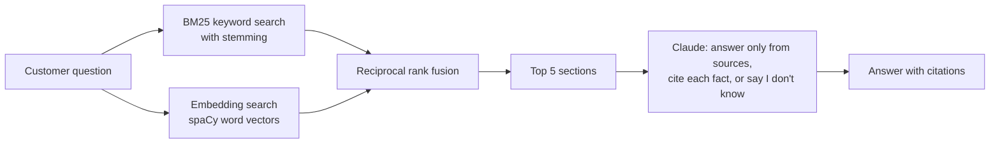

# Ask the Shop

A retrieval augmented generation (RAG) help desk assistant for a small online store, with an evaluation harness that measures how well it finds the right help article and whether its answers are grounded.

Ask a question like *"Do you deliver to Toronto?"* and it:

1. Searches 21 help center articles (68 sections) with keyword search, word embeddings, and a hybrid of both.
2. Sends the top 5 sections to Claude with a prompt that requires a citation for every fact.
3. Answers in 1 to 3 sentences with citations like `[international-shipping]`, or says *"I don't know based on our help center"* when the articles don't cover the question.

Fernwood Supply is a made-up apparel shop (the same one as the sample data in my [Monday Recap](https://github.com/Spencer695/monday-recap) project). I wrote every help article and test question for this project.

## How it works



| File | What it does |
|---|---|
| `ask_the_shop/corpus.py` | Loads the Markdown articles in `docs/` and splits each one into sections |
| `ask_the_shop/retrieval.py` | BM25, embedding, and hybrid retrievers behind one `search(question, k)` interface |
| `ask_the_shop/answer.py` | The grounded prompt, the Claude API call, and citation and abstention parsing |
| `ask_the_shop/evaluate.py` | Scores retrieval and answers on the labeled questions and writes `eval/results.md` |
| `eval/questions.jsonl` | 70 labeled questions: 60 answerable, each with its correct articles and key facts, plus 10 the help center doesn't cover |
| `tests/` | 21 pytest tests, using a fake Claude client so they run without an API key |

## Results

Retrieval on the 60 answerable questions ([full results and misses](eval/results.md)):

| Retriever | Recall@1 | Recall@3 | MRR | Right article in the top 5 sections sent to Claude |
|---|---|---|---|---|
| BM25, no stemming (baseline) | 50% | 73% | 0.65 | 78% |
| BM25 with stemming | 57% | 75% | 0.69 | 83% |
| Word embeddings | 58% | 82% | 0.72 | 83% |
| **Hybrid (BM25 + embeddings, RRF)** | **70%** | **83%** | **0.79** | **88%** |

What I learned:

* **Keyword search fails on paraphrases.** Customers rarely use the article's words: *"send something back"* instead of *"return"*, *"cap"* instead of *"hat"*, *"Toronto"* instead of *"Canada"*. Stemming helped (+7 points Recall@1) by matching *"costs"* to *"cost"*, but couldn't bridge different words.
* **Embeddings and keywords miss different questions**, so fusing their rankings beat both: the hybrid ranks the right article first 70% of the time versus 50% for the baseline.
* **Vector quality matters.** With spaCy's medium English model (20,000 distinct vectors), embedding search alone scored 45% Recall@1. The large model (343,000 distinct vectors) scored 58%.
* **Removing the common component** of the averaged vectors (Arora et al., 2017) didn't help here, so I left it out.

Answer quality is measured with `python -m ask_the_shop.evaluate --answers`, which asks Claude all 70 questions and reports:

* **Correct answer:** the answer contains every key fact for the question.
* **Cites a correct article** and **every citation is a source it was given** (no invented citations).
* **Wrongly said I don't know** on answerable questions, and **correctly said I don't know** on the 10 the help center doesn't cover.

## Running it

Requires Python 3.10 to 3.13. Installing the requirements downloads spaCy's large English word vectors (about 400 MB).

```bash
python -m venv .venv
source .venv/bin/activate          # Windows: .venv\Scripts\activate
pip install -r requirements.txt

# Retrieval only, no API key needed
python -m ask_the_shop "Do you deliver to Toronto?" --no-llm
python -m ask_the_shop.evaluate
python -m pytest

# With Claude (get a key at console.anthropic.com)
export ANTHROPIC_API_KEY=your_key   # Windows PowerShell: $env:ANTHROPIC_API_KEY="your_key"
python -m ask_the_shop "Can I return a shirt I already washed?"
python -m ask_the_shop.evaluate --answers
```

The answer step uses Claude Haiku 5.5 by default (`--model` to change it). A full answer evaluation is 70 short API calls and costs a few cents.

## Design decisions

* **Sections as chunks.** Each article section covers one topic and is 2 to 4 sentences, so a section is a natural unit to retrieve and cite. The article title and section heading are indexed with the body because they carry a lot of meaning.
* **Rank fusion instead of score blending.** BM25 scores and cosine similarities are on different scales. Reciprocal rank fusion only uses ranks, so there are no weights to tune.
* **A fixed "I don't know" sentence.** Requiring exact wording makes abstention measurable, so the evaluation can tell a refusal apart from a wrong answer.
* **Citations by article id.** Every fact must cite an id like `[returns]`. The evaluation checks that cited ids were actually among the sources given to the model.
* **A fake client in tests.** The prompt building, citation parsing, and scoring are tested without network calls or an API key.

## Limitations and next steps

* **Small, self-written test set.** 70 questions written by me, and I chose the settings above (stemming, larger vectors) by looking at the same questions, so the numbers are optimistic. Next: write a separate held-out set.
* **Word vectors are a simple embedding model.** A sentence embedding model (for example from sentence-transformers) or a cross-encoder reranker should do better on paraphrases.
* **The fact check is string matching.** It can miss a correct answer phrased differently. An LLM grader with a rubric, spot-checked by hand, would be more reliable.

## Built with

Python, rank-bm25, spaCy word vectors, NumPy, the Anthropic API, and pytest. I built it with Claude as an AI pair programmer.
