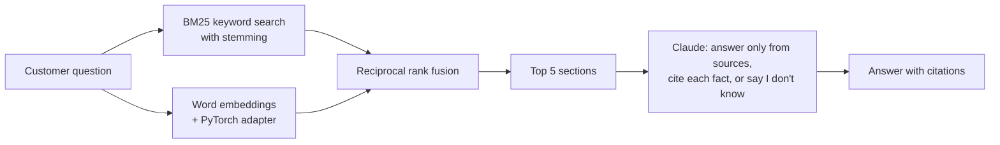

# Ask the Shop

A retrieval augmented generation (RAG) help desk assistant for a small online store, with embeddings fine-tuned in PyTorch and an evaluation harness that measures how well it finds the right help article and whether its answers are grounded.

Ask a question like *"Do you deliver to Toronto?"* and it:

1. Searches 21 help center articles (68 sections) with keyword search, word embeddings, and a hybrid of both.
2. Sends the top 5 sections to Claude with a prompt that requires a citation for every fact.
3. Answers in 1 to 3 sentences with citations like `[international-shipping]`, or says *"I don't know based on our help center"* when the articles don't cover the question.

Fernwood Supply is a made-up apparel shop (the same one as the sample data in my [Monday Recap](https://github.com/Spencer695/monday-recap) project). I wrote every help article and question for this project.

## How it works



| File | What it does |
|---|---|
| `ask_the_shop/corpus.py` | Loads the Markdown articles in `docs/` and splits each one into sections |
| `ask_the_shop/retrieval.py` | BM25, embedding, and hybrid retrievers behind one `search(question, k)` interface |
| `ask_the_shop/adapter.py` | Fine-tunes the embeddings in PyTorch with a contrastive loss; cross validation and training |
| `ask_the_shop/answer.py` | The grounded prompt, the Claude API call, and citation and abstention parsing |
| `ask_the_shop/evaluate.py` | Scores retrieval and answers on the test questions and writes `eval/results.md` |
| `eval/questions.jsonl` | **Test set:** 70 labeled questions, 60 answerable (each with its correct articles and key facts) and 10 the help center doesn't cover |
| `eval/train_questions.jsonl` | **Training set:** 105 separate questions, 5 per article, used only to train the adapter |
| `models/adapter.pt` | The trained adapter weights (77 KB) |
| `tests/` | 32 pytest tests, using a fake Claude client so they run without an API key |

## Results

Retrieval on the 60 answerable test questions ([full results and misses](eval/results.md)):

| Retriever | Recall@1 | Recall@3 | MRR | Right article in the top 5 sections sent to Claude |
|---|---|---|---|---|
| BM25, no stemming (baseline) | 50% | 73% | 0.65 | 78% |
| BM25 with stemming | 57% | 75% | 0.69 | 83% |
| Word embeddings | 58% | 82% | 0.72 | 83% |
| Word embeddings, fine-tuned | 65% | 88% | 0.77 | 88% |
| Hybrid (BM25 + embeddings, RRF) | **70%** | 83% | **0.79** | 88% |
| Hybrid with fine-tuned embeddings | 68% | **88%** | 0.78 | **90%** |

What I learned:

* **Keyword search fails on paraphrases.** Customers rarely use the article's words: *"send something back"* instead of *"return"*, *"cap"* instead of *"hat"*, *"Toronto"* instead of *"Canada"*. Stemming helped (+7 points Recall@1) by matching *"costs"* to *"cost"*, but couldn't bridge different words.
* **Embeddings and keywords miss different questions**, so fusing their rankings beat both: the hybrid ranks the right article first 70% of the time versus 50% for the baseline.
* **Vector quality matters.** With spaCy's medium English model (20,000 distinct vectors), embedding search alone scored 45% Recall@1. The large model (343,000 distinct vectors) scored 58%.
* **Fine-tuning helped the embeddings on questions it never saw** (Recall@1 58% to 65%, Recall@3 82% to 88%). It moved the right article to first place on 7 test questions and knocked it out of first on 3. In the hybrid, BM25 already ranked 3 of those 7 first, so the gain was smaller: the right article reached Claude's context more often (88% to 90%), but Recall@1 dipped (70% to 68%, one question gained and two lost).
* **Removing the common component** of the averaged vectors (Arora et al., 2017) didn't help here, so I left it out.

## Fine-tuning the embeddings in PyTorch

The spaCy word vectors are general English, so they don't know that in this shop a *cap* is the dad hat or that *send it back* means a return. `adapter.py` learns a correction to the vector space from labeled questions.

* **Model:** `x -> normalize(x + x V U^T)`, a rank 32 residual applied to both questions and sections. V starts at zero, so the untrained adapter changes nothing, and a penalty keeps the correction small. A full 300 x 300 matrix overfit within a few steps.
* **Loss:** cosine similarity to every section, combined per article with logsumexp, then cross entropy against the correct article. The other 20 articles act as negatives, so it's a contrastive objective.
* **Data:** 105 handwritten training questions plus the 68 section headings as pseudo questions. A test checks that no training question appears in the test set.
* **Choosing settings:** 5 fold cross validation on the training questions only. It cut validation loss from 1.40 to 0.81 and raised validation top 1 accuracy from 73% to 76%. The final adapter trains on all training questions for the average best epoch count (83). The test set was used once, for the table above.

Retrain with `python -m ask_the_shop.adapter`; it prints the cross validation results and saves `models/adapter.pt`.

## Answer quality

`python -m ask_the_shop.evaluate --answers` asks Claude all 70 test questions and reports:

* **Correct answer:** the answer contains every key fact for the question.
* **Cites a correct article** and **every citation is a source it was given** (no invented citations).
* **Wrongly said I don't know** on answerable questions, and **correctly said I don't know** on the 10 the help center doesn't cover.

## Running it

Requires Python 3.10 to 3.13. Installing the requirements downloads PyTorch and spaCy's large English word vectors (about 400 MB). On Linux, `pip install torch --index-url https://download.pytorch.org/whl/cpu` first avoids the much larger GPU build.

```bash
python -m venv .venv
source .venv/bin/activate          # Windows: .venv\Scripts\activate
pip install -r requirements.txt

# Retrieval only, no API key needed
python -m ask_the_shop "Do you deliver to Toronto?" --no-llm
python -m ask_the_shop "Will the cap fit me?" --no-llm --retriever embeddings-tuned
python -m ask_the_shop.evaluate
python -m ask_the_shop.adapter     # retrain the adapter
python -m pytest

# With Claude (get a key at console.anthropic.com)
export ANTHROPIC_API_KEY=your_key   # Windows PowerShell: $env:ANTHROPIC_API_KEY="your_key"
python -m ask_the_shop "Can I return a shirt I already washed?"
python -m ask_the_shop.evaluate --answers
```

The answer step uses Claude Haiku 5.5 by default (`--model` to change it). A full answer evaluation is 70 short API calls and costs a few cents.

## Design decisions

* **Sections as chunks.** Each article section covers one topic and is 2 to 4 sentences, so a section is a natural unit to retrieve and cite. The article title and section heading are indexed with the body because they carry a lot of meaning.
* **Rank fusion instead of score blending.** BM25 scores and cosine similarities are on different scales. Reciprocal rank fusion only uses ranks, so there are no weights to tune.
* **A small, residual adapter.** With about 170 training examples, the model has to start from the original vectors and stay close to them. Low rank and a size penalty did that; a full matrix memorized the training questions.
* **A fixed "I don't know" sentence.** Requiring exact wording makes abstention measurable, so the evaluation can tell a refusal apart from a wrong answer.
* **Citations by article id.** Every fact must cite an id like `[returns]`. The evaluation checks that cited ids were actually among the sources given to the model.
* **A fake client in tests.** The prompt building, citation parsing, and scoring are tested without network calls or an API key.

## Limitations and next steps

* **Small, self-written data.** All questions were written by me. I chose stemming and the larger vectors by looking at the test set, so those rows are optimistic; the adapter's settings came from cross validation on separate training data. Next: collect real customer questions.
* **Word vectors are a simple embedding model.** Fine-tuning a sentence embedding model (for example from sentence-transformers) the same way, or adding a cross-encoder reranker, should do better on paraphrases.
* **The fact check is string matching.** It can miss a correct answer phrased differently. An LLM grader with a rubric, spot-checked by hand, would be more reliable.

## Built with

Python, PyTorch, rank-bm25, spaCy word vectors, NumPy, the Anthropic API, and pytest. I built it with Claude as an AI pair programmer.
